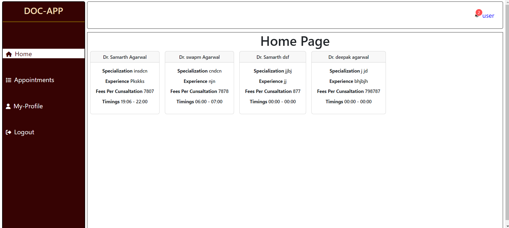
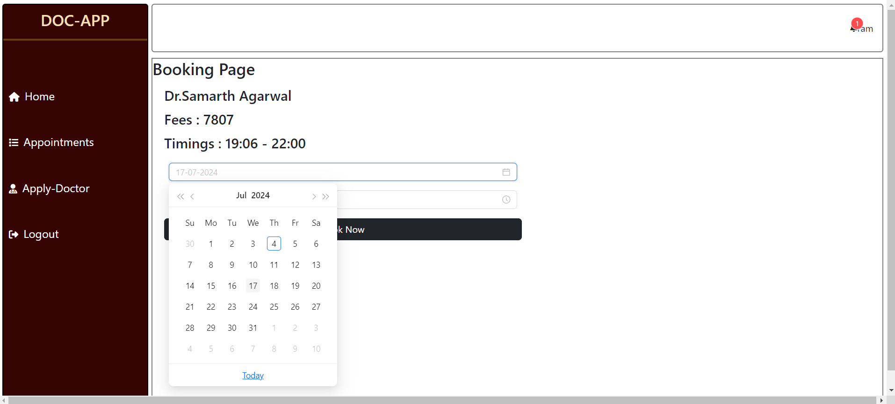
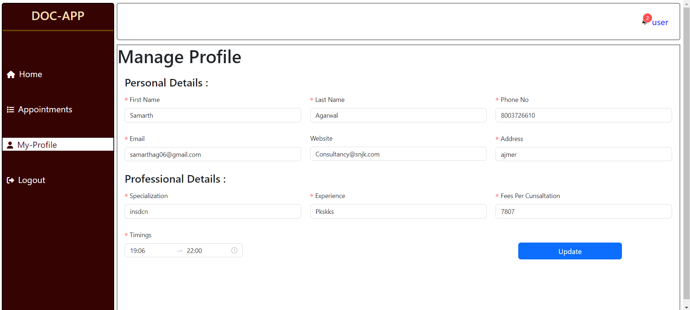
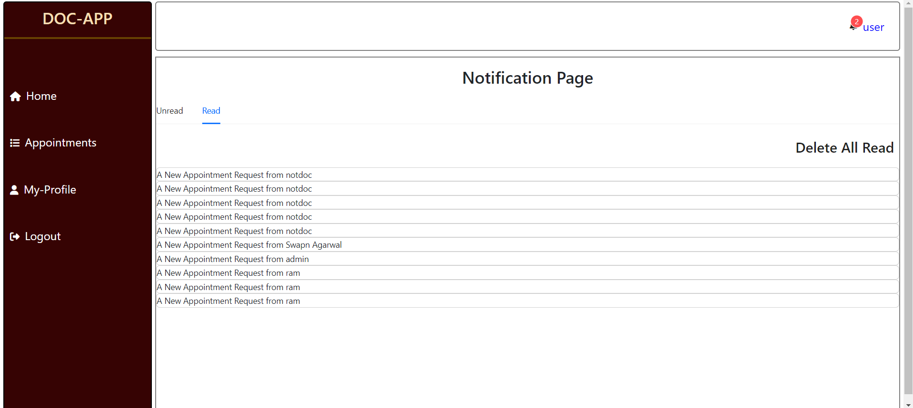
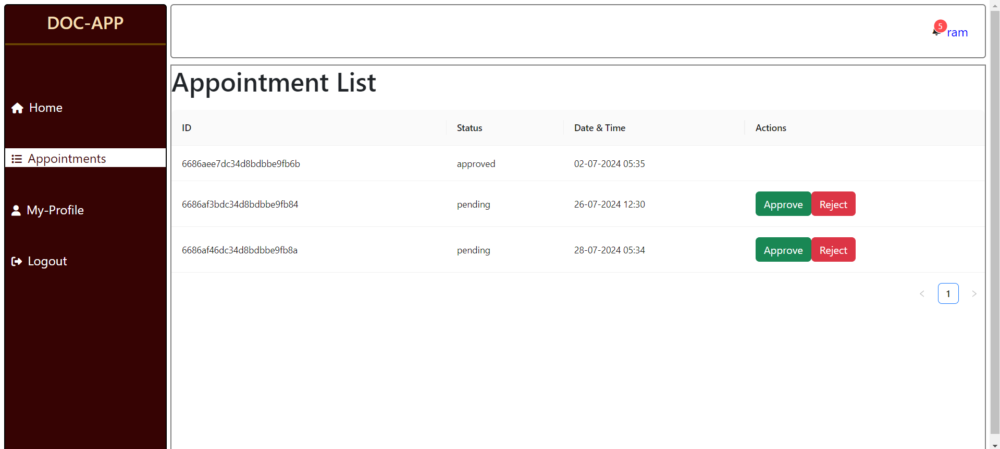

# HealthHub

HealthHub is a comprehensive doctor appointment application. It allows users to register and apply for doctor accounts, book appointments, and receive notifications about the status of their requests. Admins have the ability to approve doctor accounts, and doctors can manage their profiles. The application is built using the MERN stack, along with additional libraries and tools to enhance functionality and user experience.

## Features

- **User Registration and Login:** Users can register and log in securely using JWT and bcrypt.js.
- **Doctor Account Application:** Users can apply for doctor accounts which need to be approved by the admin.
- **Admin Panel:** Admins can approve or reject doctor account applications.
- **Doctor Profile Management:** Doctors can manage their profiles and update their availability.
- **Appointment Booking:** Users can book appointments with available doctors.
- **Notifications:** Users and doctors receive notifications about the status of their requests (approved or rejected).
- **Secure Routes:** All routes are secured using JSON Web Tokens.
- **Real-Time Updates:** Notifications can be marked as read.

## Technologies Used

- **Frontend:**
  - React
  - Redux
  - Ant Design (antd)
  - Axios

- **Backend:**
  - Node.js
  - Express

- **Database:**
  - MongoDB

- **Authentication:**
  - JSON Web Token (jsonwebtoken)
  - bcrypt.js

## Deployment

The application is deployed and can be accessed at: [HealthHub](https://doctor-application-platform.onrender.com/)

## Installation

1. Clone the repository:
    ```bash
    git clone https://github.com/Akash-r-m/health-hub.git
    ```

2. Navigate to the project directory:
    ```bash
    cd HealthHub
    ```

3. Install server dependencies:
    ```bash
    npm install
    ```

4. Install client dependencies:
    ```bash
    cd client
    npm install
    ```

## Running the Application

1. Start the backend server:
    ```bash
    npm start
    ```

2. Start the frontend server:
    ```bash
    cd client
    npm start
    ```

3. Open your browser and navigate to `http://localhost:3000` to see the application.

## Screenshots

### Home Page


### Booking Appointment


### Manage Profile


### Notification Page


### Appointments Page


### Apply Doctor Account Page


